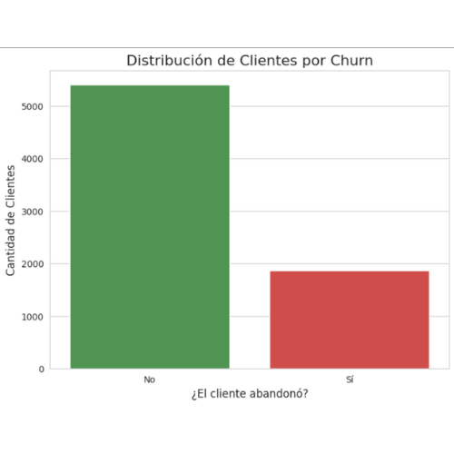
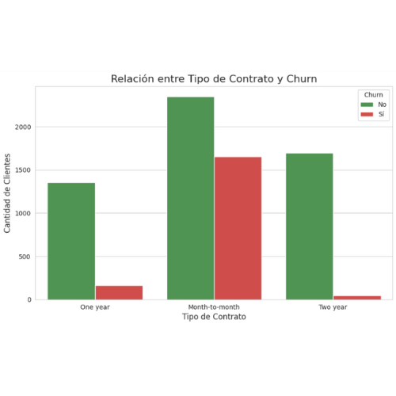
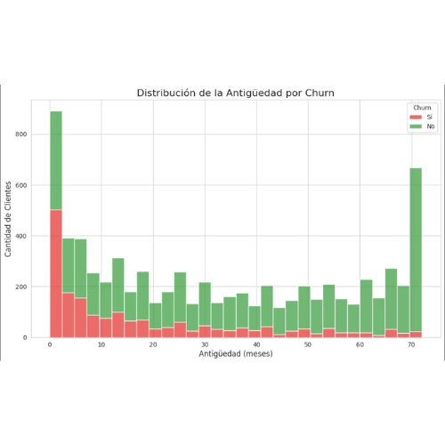

# Proyecto ETL y Análisis: Churn de Telecomunicaciones (Versión Modular)

## 1. Descripción del Proyecto

Este proyecto presenta un flujo de trabajo completo de análisis de datos, desde la **Extracción, Transformación y Carga (ETL)** hasta el **Análisis Exploratorio de Datos (EDA)**. El objetivo es analizar los factores que influyen en el abandono de clientes (Churn) en una empresa de telecomunicaciones.

La característica principal de este proyecto es su **estructura modular y funcional**, que demuestra un enfoque de programación ordenado y escalable, aplicando buenas prácticas de ingeniería de software al campo de la ciencia de datos.

## 2. Estructura del Proyecto

El código está organizado en un notebook de Google Colab dividido en cuatro partes lógicas para una máxima claridad y mantenibilidad:

1.  **Configuración e Importaciones:** Una celda inicial para cargar todas las dependencias.
2.  **Definición de Funciones ETL:** Un conjunto de funciones (`cargar_datos_locales`, `crear_dataframe_desde_json`, `limpiar_y_transformar_datos`) que encapsulan toda la lógica de preparación de los datos.
3.  **Definición de la Función de Visualización:** Una función única (`generar_visualizaciones`) dedicada a crear todos los gráficos del análisis.
4.  **Ejecución (`main`):** Una celda final que actúa como orquestador, llamando a las funciones anteriores en el orden correcto para ejecutar todo el proceso de forma controlada.

## 3. Visualizaciones Clave y Hallazgos

A partir del DataFrame limpio, se generaron visualizaciones para extraer insights clave sobre el comportamiento de los clientes.

### Distribución del Churn
Se observa un desbalance natural en los datos: la mayoría de los clientes son leales. Este es un punto de partida crucial para cualquier análisis predictivo.

### Influencia del Tipo de Contrato
El análisis revela una fuerte correlación: los clientes con **contratos de mes a mes** son significativamente más propensos a abandonar el servicio, mientras que los contratos a largo plazo promueven la retención.

### Influencia de la Antigüedad (Tenure)
La antigüedad del cliente es otro factor determinante. Los **clientes más nuevos** presentan la tasa de abandono más alta. La lealtad aumenta considerablemente a medida que el cliente permanece más tiempo en la compañía.

## 4. Tecnologías Utilizadas

* **Lenguaje:** Python 3.x
* **Bibliotecas Principales:**
    * `Pandas`: Para la manipulación y el análisis de datos.
    * `Matplotlib` & `Seaborn`: Para la visualización de datos.
    * `JSON`: Para el manejo del archivo de entrada.
* **Entorno:** Google Colab

## 5. Cómo Utilizar este Repositorio

1.  Clona el repositorio en tu máquina local.
2.  Abre el notebook (`.ipynb`) en Google Colab o un entorno similar.
3.  Asegúrate de que el archivo `TelecomX_Data.json` esté en la misma ruta que el notebook.
4.  Ejecuta las celdas en orden secuencial para replicar todo el proceso, desde la carga de datos hasta la generación de los gráficos.